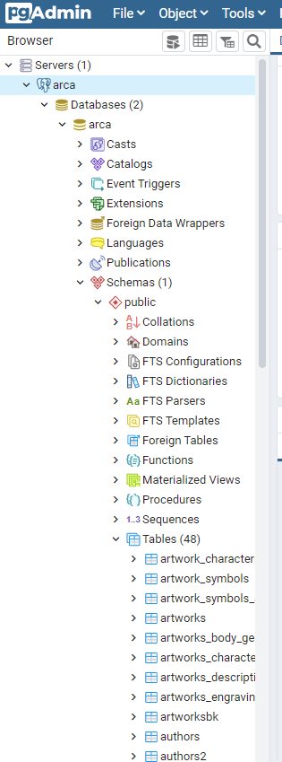

# Arca API

La aplicación para el administrador de contenido del proyecto Arca.

## Instalación

**Debes tener instalado Docker.**

1. Clonar este repositorio.
2. Pedir el último dump y poner el archivo `.sql` en la carpeta `/dump/` 
3. Iniciar contenedores:

```bash
docker-compose up -d
```
En la primera iniciada de los contenedores a veces es bueno dejarlo sin `-d` para ir viendo todo el primer proceso de instalación y preparación de los contenedores, si hay errores los vamos a poder ver en el terminal. Pero luego de tenerlos instalados, cada ves que queremos iniciar los contenedores podemos poner el flag `-d` para que el terminal no quede ocupado.

Esto va a instalar 4 aplicaciones en 4 contenedores separados que se conectan entre si (Ver archivo `docker-compose.yml`):

- **Directus**: El CMS disponible en [localhost:8055](http://localhost:8055)  
usuario: **admin@admin.com**   
clave: **admin**
- **Postgres**: La base de datos.
- **Redis**: El sistema de Cache.
- **PgAdmin 4**: GUI para trabajar con la base de datos desde [localhost:5050](http://localhost:5050)  
usuario: **admin@admin.com**   
clave: **admin**

### Carpeta `/dump` con archivo `sql`

En la primera vez que iniciamos `docker-compose up`, el archivo que este en `/dump/**.sql` se va a copiar a la carpeta `/docker-entrypoint-initdb.d` dentro del contenedor que tiene el Postgres (base de datos). Al encontrarse con ese archivo en una instalación nueva del contenedor, este se va a saltar los valores predeterminados del `docker-compose` y va a llenar las tablas con los datos y schema del `/dump/**.sql`. Esto significa que toda la configuración de Directus y Colecciones que se han modelado en el, quedan iguales en nuestro Directus de desarrollo local.

Esto quiere decir que cuando tenemos un nuevo dump, luego de hacer un adelanto en el modelado de datos o configuración en Directus de manera local, se debe hacer un nuevo dump y compartirlo con los desarrolladores para que puedan volver a instalar el contendedor desde cero.

No es la manera ideal de trabajo y cuando instalemos el CMS en el servidor, esto se vuelve innecesario pues ya quedan los datos centralizados y disponibles a todos. De momento usamos este método para darle inicio al desarrollo y primeras pruebas.

#### Reiniciar la base de datos con un nuevo dump

Apagar los contenedores:

```bash
docker-compose down
```

Borrar la carpeta `./datos` que se genera automáticamente dentro de la carpeta de este proyecto.

Volver a iniciar los contenedores:

```bash
docker-compose up -d
```

Esto vuelve a crear la carpeta local `./datos` y la base de datos va a tener la nueva estructura del archivo `./dump/**.sql`.

#### Crear un dump para compartir cambios

Esto lo van a hacer luego de que se adelanten cambios importantes en Directus que necesiten compartir con los otros desarrolladores.

Teniendo los contenedores prendidos, usar el siguiente comando:

```bash
docker exec -t arca-cms-bd pg_dump -U arca enflujo > ./arcabd.sql
```

Esto corresponde a:

- **`arca-cms-bd`**: El nombre del contenedor de Postgres en `docker-compose-yml`. El que se pone en el campo `container_name: "arca-cms-bd"`.
- **`arca`**: nombre del usuario que en `.env` es `BD_USUARIO=arca`.
- **`enflujo`**: nombre de la base de datos que en `.env` es `BD_NOMBRE_BD=enflujo`.

Tener cuidado que esto va a reemplazar el archivo actual.

:exclamation: **En la carpeta `./dump` sólo debe existir 1 archivo de sql para que esto funcione.**

### (Opcional) Configuración PgAdmin 4

El administrador de PgAdmin permite tener una interfaz gráfica para ver, modificar y hacer todo tipo de *query* directo en la base de datos. Estos se ven reflejados en el Directus. *No es necesario usarlo pero queda incluido para facilitar algunos procesos manuales sobre la base de datos.*

Para instalarlo, agregar el servicio en `docker-compose.yml`:

```yaml
pgadmin:
    container_name: arca-cms-pgadmin
    image: dpage/pgadmin4
    restart: unless-stopped
    ports:
      - 5050:80
    volumes:
      - ./pgadmin:/var/lib/pgadmin
    depends_on:
      - database
    networks:
      - arca-cms-red
    environment:
      PGADMIN_DEFAULT_EMAIL: 'admin@admin.com'
      PGADMIN_DEFAULT_PASSWORD: 'admin'
```

Para ingresar se debe ir a: [localhost:5050](http://localhost:5050)

Admin: **admin@admin.com**  
Clave: **admin**

1. Hacer clic derecho sobre Server: Create -> Server...


2. En la pestaña General nombrar el servidor `arca`


3. En la pestaña Connections usar la siguiente configuración que son las mismas que usamos en el `docker-compose.yml`:

- Host: **arca-cms-database** _(Como tenemos la base de datos en un contenedor aparte, podemos usar el nombre de ese contenedor)_
- Port: **5432**
- Maintainance Database: **postgres** _(predeterminado)_
- Username: **arca**
- Password: **arca**
- Save Password: **[x]**


Al iniciar los contenedores importamos los datos así que esta conexión nos debe mostrar los datos en la sección `Schemas->Tables`, algo similar a esto:



Todas las tablas que inician con el nombre `directus_...` corresponden a la configuración del CMS Directus, las otras son las "Colecciones" que se crean y modelan dentro del CMS.

## Ayudas

Algunas notas sobre Docker y docker-compose.

### `volumes` en Docker

Un principio importante en Docker es que los contenedores e imágenes son efímeras, cuando apagamos un contenedor, los datos de éste desaparecen. Para poder persistir los datos (ej. los datos dentro de *Directus*, la configuración en *PgAdmin*) usamos la idea de `volumes`. Estos los podemos pensar como una copia local de alguna carpeta dentro del contenedor. Cuando iniciamos el contenedor, los datos del volumen local se pasan al contenedor y de esta forma persisten durante el desarrollo. **Todas las carpetas locales de nuestros volumenes son ignoradas por git.** ya que le pertenecen a cada uno, pueden jugar, cambiar cosas, luego borra todo y comenzar de cero. 

Estos `volumes` los pueden ver en el `docker-compose.yml` y en las carpetas que se crean en su computador. 

Por ejemplo:

```yml
volumes:
  - ./pgadmin:/var/lib/pgadmin
```

Estos son los que definimos para el contenedor de *PgAdmin*. `./pgadmin` es la carpeta local y `/var/lib/pgadmin` es la carpeta en el contenedor. Siempre van a ver dos rutas separadas por `:` la primera es la local y la segunda es la del contenedor: **`[local]:[contenedor]`**. Si borramos la local e iniciamos el contenedor, desaparece cualquier configuración que hicimos antes y se vuelve a crear la carpeta local, esto es útil cuando queremos comenzar desde cero.

En el caso del contenedor de *PostgresQL* es útil esto ya que cuando queremos cargar un nuevo *dump* de un archivo `.sql` usamos 2 `volumes` para facilitar el proceso.

```yml
volumes:
  - ./dump:/docker-entrypoint-initdb.d
  - ./datos:/var/lib/postgresql/data
```

El archivo `***.sql` que ponemos en la carpeta `/dump` del primer volumen se pasa a la carpeta `/docker-entrypoint-initdb.d` en el contenedor. Esta es una carpeta especial de *postgres* ya que si no existe base de datos y hay archivos `.sql` en esta carpeta, lo usa para crear y llenar la base de datos inicial. Si `/docker-entrypoint-initdb.d` esta vacía, simplemente crea una base de datos vacía. En teoría podemos poner diferentes archivos `.sql` en esta carpeta para correr diferentes procesos al iniciar la base de datos, pero en nuestro caso sólo usamos una que contiene toda la estructura y datos. Por esa razón sólo ponemos 1 archivo (si dejamos varios `.sql` que crean la misma base de datos, va a ejecutar todos y podemos tener resultados inesperados).

Para que importe un nuevo *dump* debemos borrar los datos que existen ya que los `.sql` en `/docker-entrypoint-initdb.d` sólo se ejecutan si no existen datos en el contenedor. Para eso, cuando traemos un nuevo *dump* a `/dump`, debemos borrar el del otro volumen `/datos/`. Así el contenedor reconoce que no hay datos, importa los del nuevo *dump* y vuelve a crear la carpeta `/datos` localmente con la nueva información.
